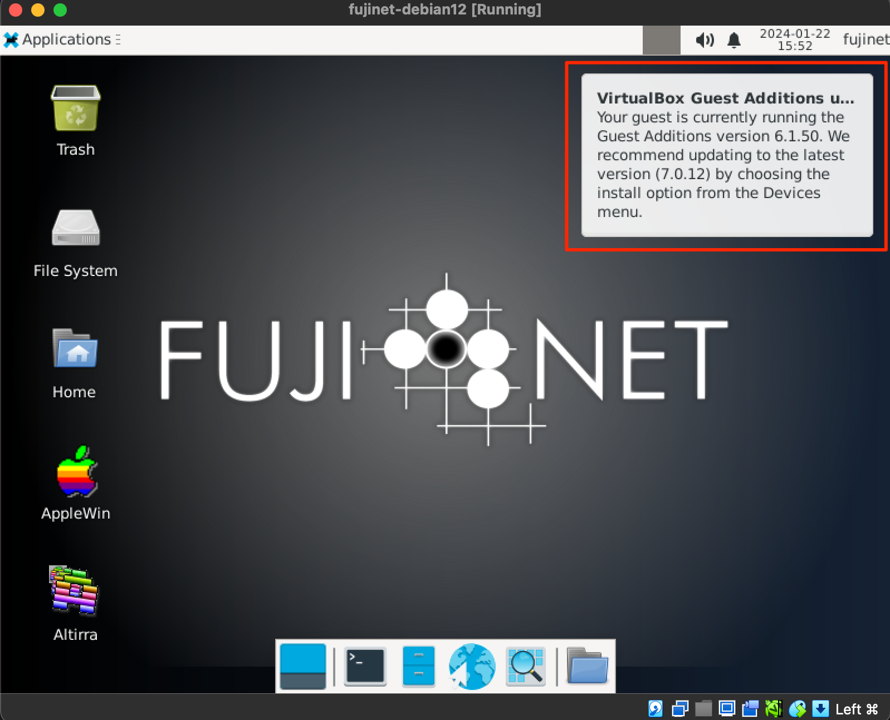

# FujiNet Packer VirtualBox Build

This repository contains Packer configuration that will build a VirtualBox VM including pre-configured Altirra & AppleWin emulators that interface with the FujiNet-PC virtual device.  

## Downloading the VM

[Download VirtualMachine OVA](https://mega.nz/folder/4L03hKRL#L1GOblpv8xbHROaKIPb1xg) (this is approximately 3.6GB in size).

## Importing the VM

The results of building the Packer configuration is a VirtualBox OVA appliance VM that can be imported into VirtualBox under the `File` -> `Import Appliance...` menu.  The defaults should work fine when importing the OVA.

One item that may be desirable to configure before booting the VM is setting the scaling of the display.  This will depend on the resolution of the screen you're running the VM on & personal preferences.  Setting this scaling configuration to 200% works well on high-resolution/high-dpi screens: 


## Running the VM

The default authentication for the built VM are as follows: 

- Username: `fujinet`
- Password: `online`

After booting & logging into the VM the first time VirtualBox will display a notice if the version of VirtualBox is newer than the Guest Additions installed in the VM.  Currently the VM is built with VirtualBox version 6.1 while the current version of VirtualBox is 7.0.  If the following notice appears it can be safely ignored by either clicking on it or waiting for it to disappear automatically.  



## Pre-configured Items

- Altirra - run via Wine - Starts the FujiNet-PC (`fn-pc-atari.service`) & FujiNet Emulator Bridge (`fn-emulator-bridge.service`) services automatically when started from the desktop launcher icon
- AppleWin for Linux - Starts the FujiNet-PC (`fn-pc-apple.service`) service automatically when started from the desktop launcher icon
- [fujinet-platformio](https://github.com/FujiNetWIFI/fujinet-platformio) - Git repository cloned to `$HOME/FujiNet/fujinet-platformio`
- [fujinet-apps](https://github.com/FujiNetWIFI/fujinet-apps) - Git repository cloned to `$HOME/FujiNet/fujinet-apps`

See the [FujiNet Wiki](https://github.com/FujiNetWIFI/fujinet-platformio/wiki) for more details on using FujiNet.

## Building the VM with Packer

>**_NOTE:_** This has yet to be written.
```shell
./packer_build.sh
```

