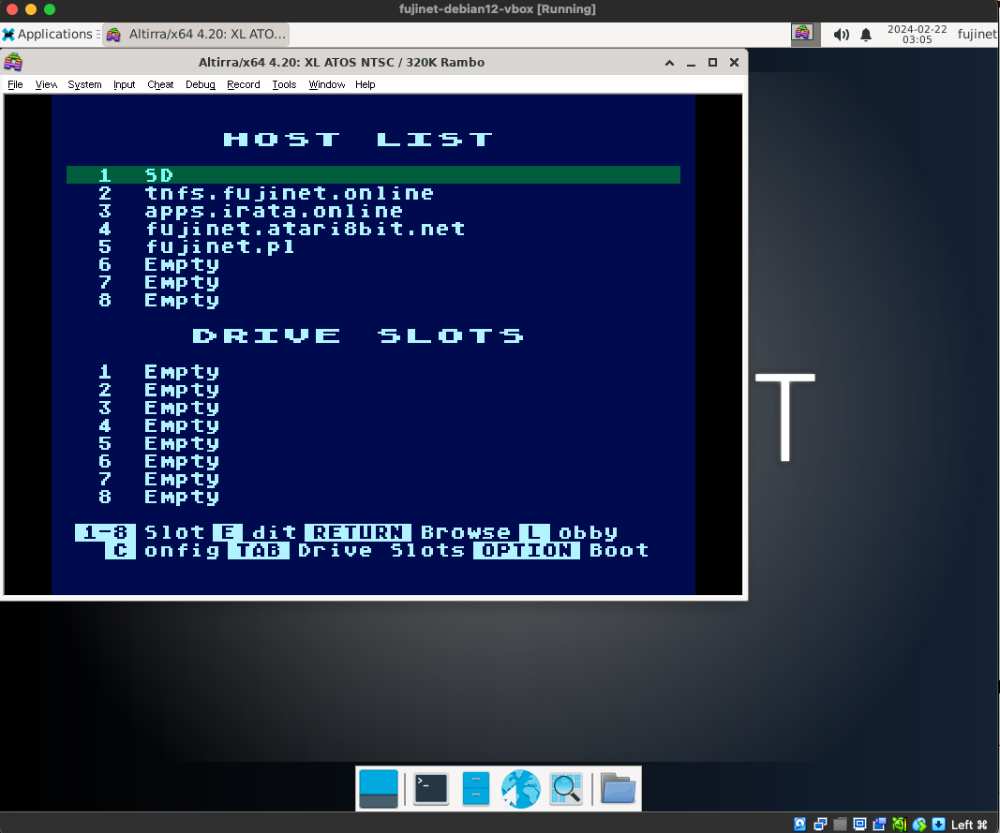
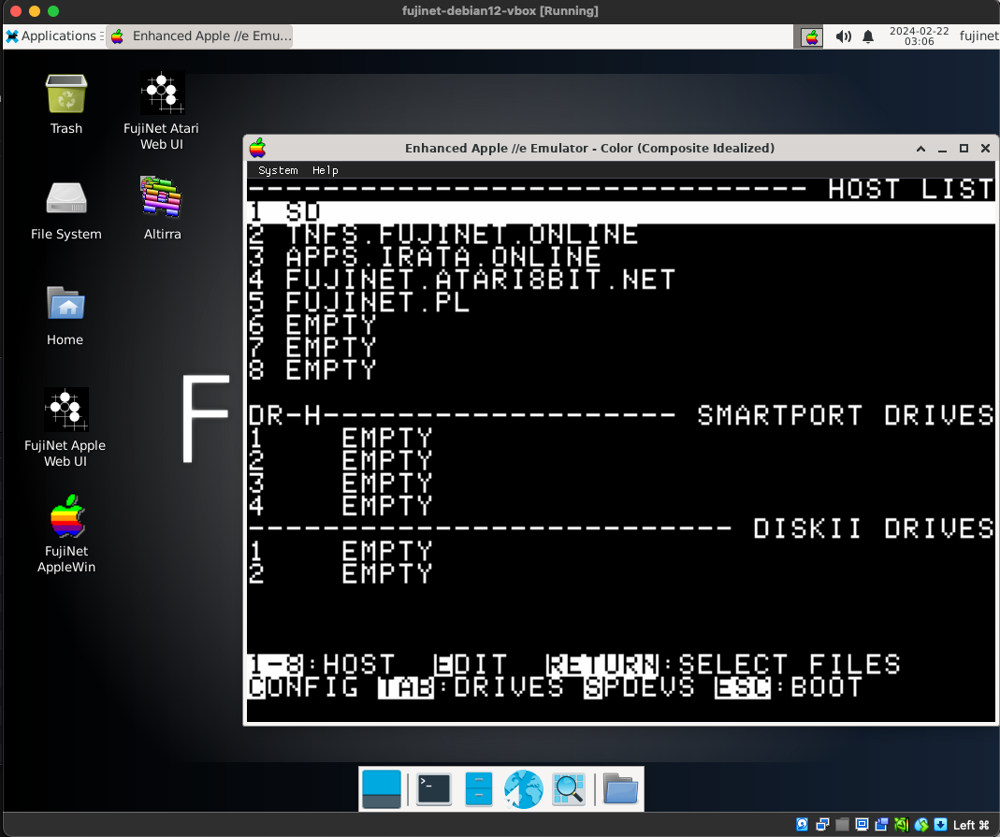

# Running the Emulators

Multiple emulators are built into this VM & pre-configured to work with a virtual FujiNet device. 

## Altirra (Atari)

[Altirra](https://virtualdub.org/altirra.html) is a popular emulator for various Atari systems.  While the FujiNet VM is built using Linux, Altirra requires Windows.  To make this work [Wine](https://www.winehq.org/) has been installed which allows Altirra to run on Linux just like if it were running on Windows natively.  

To start the Altirra emulator double-click on the icon on the desktop named "Altirra".  The emulator will start & boot the FujiNet device automatically.

## AppleWin (Apple II)

FujiNet VM uses a [customized build](https://github.com/FujiNetWIFI/AppleWin) of the Linux port of the official [AppleWin](https://github.com/AppleWin/AppleWin) project.  The original/official AppleWin requires Windows but the customized version that runs inside the VM is a ported Linux-native version which runs very efficiently.  

Just like with the Altirra emulator, the AppleWin emulator can be started by double-clicking on the desktop icon labeled "AppleWin".  The emulator should automatically boot with the FujiNet virtual device attached & run the CONFIG utility.

