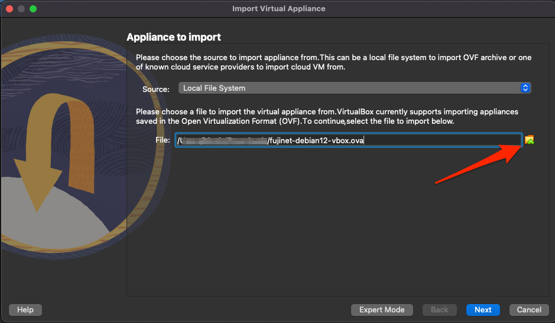
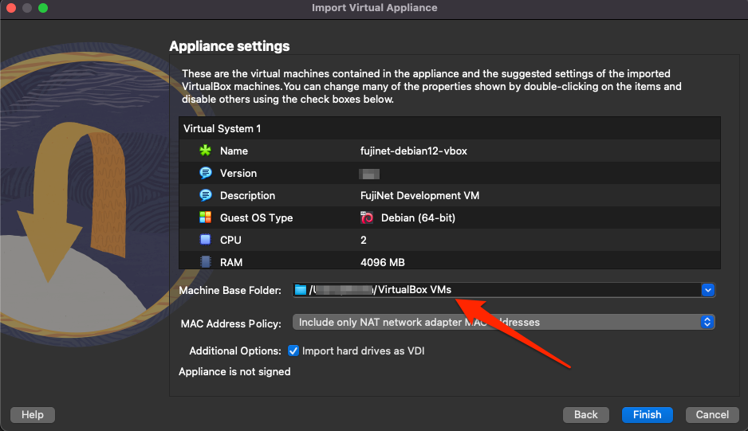
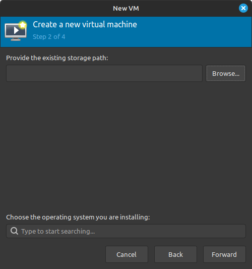
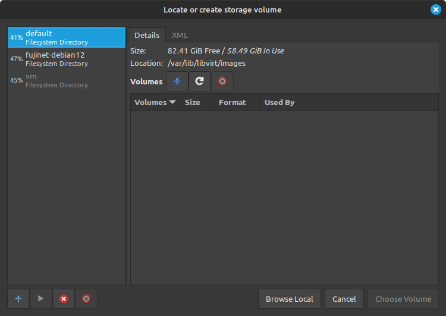
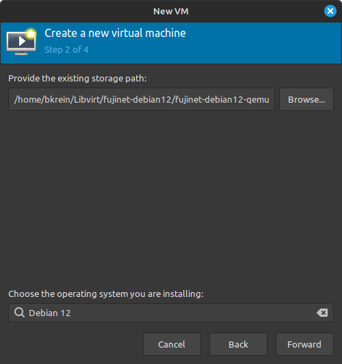
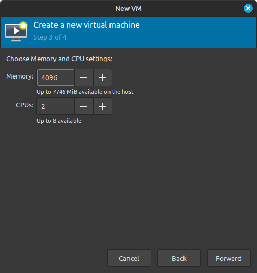
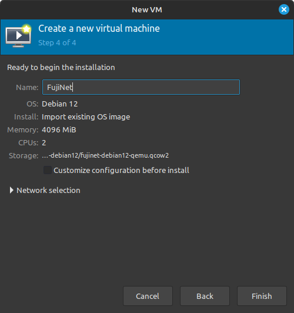

# Getting Started

## Downloading the VM

[Download Virtual Machine Image](https://mega.nz/folder/4L03hKRL#L1GOblpv8xbHROaKIPb1xg) (this is approximately 3.6GB in size).

- `*.ova` - VirtualBox appliance version
- `*.qcow2` - QEMU/Libvirt disk image version

## Importing the VM

### VirtualBox OVA

The results of building the Packer configuration is a VirtualBox OVA appliance VM that can be imported into VirtualBox under the `File` -> `Import Appliance...` menu.  The defaults should work fine when importing the OVA.

### QEMU/Libvirt

A `qcow2` version of the same VM is generated as well & can be used with QEMU/Libvirt hypervisors.  The following discribes how to import the image into a new VM using [Virtual Machine Manager](https://virt-manager.org/) in Linux.

1. Open Virtual Machine Manager & from the main window select `File -> New Virtual Machine`
1. Check `Import existing disk image`

    

1. Click on the `Browse Local` button at the bottom of the volumes selector window

    

1. Find the `qcow2` file that was downloaded
1. Search for & select `Debian 12` for the operating system being installed

    

1. Increase the default memory to **at least** `4096` (`4GB` - more will provide better performance)

    

1. Provide a name for the new VM (eg, `FujiNet`)

    

1. Click `Finish` to complete the VM creation

## Running the VM

The VM is configured to auto-login the `fujinet` user, however if there are any activities where the password is needed the following are the credentials given to the `fujinet` user:

- Username: `fujinet`
- Password: `online`

## Pre-configured Items

- Altirra - run via Wine - Starts the FujiNet-PC (`fn-pc-atari.service`) & FujiNet Emulator Bridge (`fn-emulator-bridge.service`) services automatically when started from the desktop launcher icon
- AppleWin for Linux - Starts the FujiNet-PC (`fn-pc-apple.service`) service automatically when started from the desktop launcher icon
- [fujinet-platformio](https://github.com/FujiNetWIFI/fujinet-platformio) - Git repository cloned to `$HOME/FujiNet/fujinet-platformio`
- [fujinet-apps](https://github.com/FujiNetWIFI/fujinet-apps) - Git repository cloned to `$HOME/FujiNet/fujinet-apps`

See the [FujiNet Wiki](https://github.com/FujiNetWIFI/fujinet-platformio/wiki) for more details on using FujiNet.
