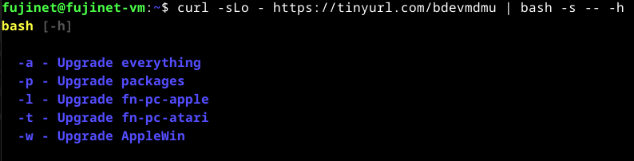

# Tips & Tricks

## Improving Performance 

The VM was configured with very basic resource requirements considered to be the minimum required to run the emulators within the VM.  If your system has more resources available then adjusting the memory settings to give the VM more memory resources will greatly improve performance & stability.  

The default memory allocation is 4GB but it is recommended to run the VM with 8GB or more RAM if possible. 

## Scaling the VM Window

On some very high resolution displays the VM window can appear very small & hard to read.  Just resizing the window will not make the contents easier to read however.  If this is the case it may be desirable to adjust the scaling of the VM window to enlarge (or reduce) the size of the content.  Changing the `Scale Factor` to `200%`, for instance will double the size of everything displayed in the VM window.


## Upgrading VM

Some components of the VM can be upgraded in place without having to wait for a new version to be built & made available.  A script has been created that will perform various upgrades automatically that can be run in a terminal via a `curl` command piped to the `bash` shell:

```shell
curl -sLo - https://tinyurl.com/bdevmdmu | bash -s -- -h
```



Replace the `-h` in the above command with the appropriate flag to pass to the script as per the help output.
