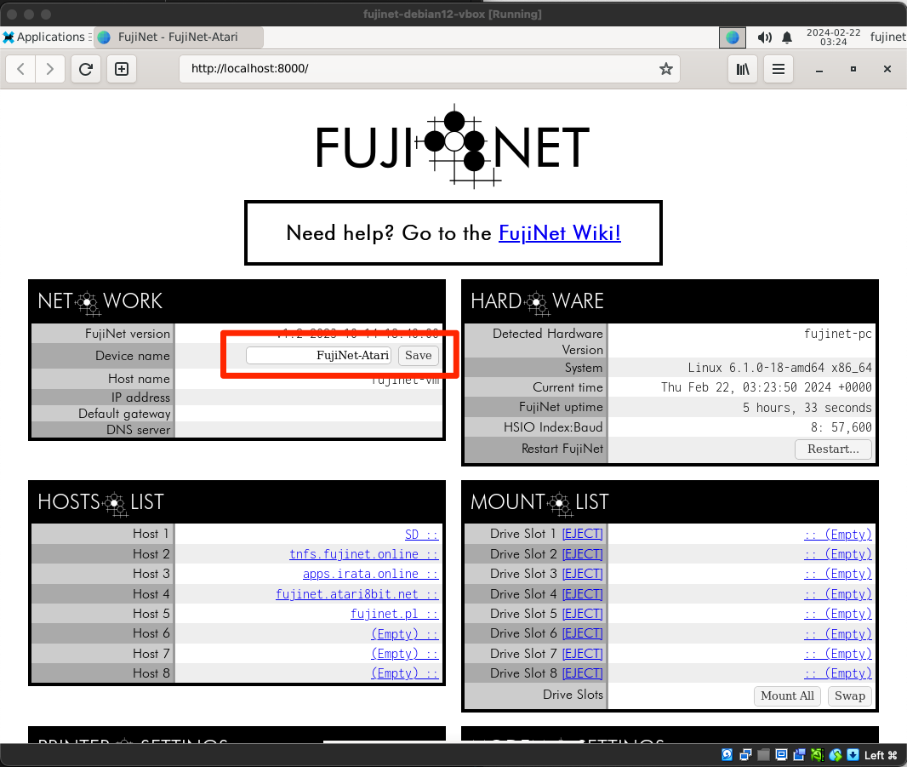
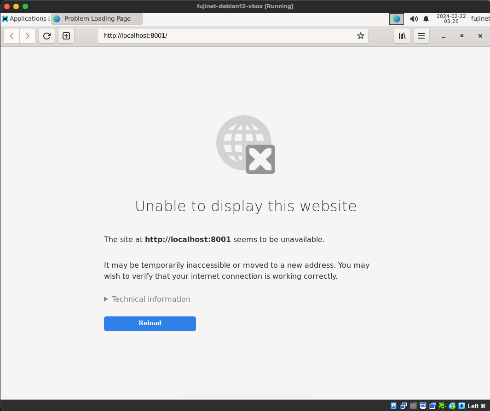
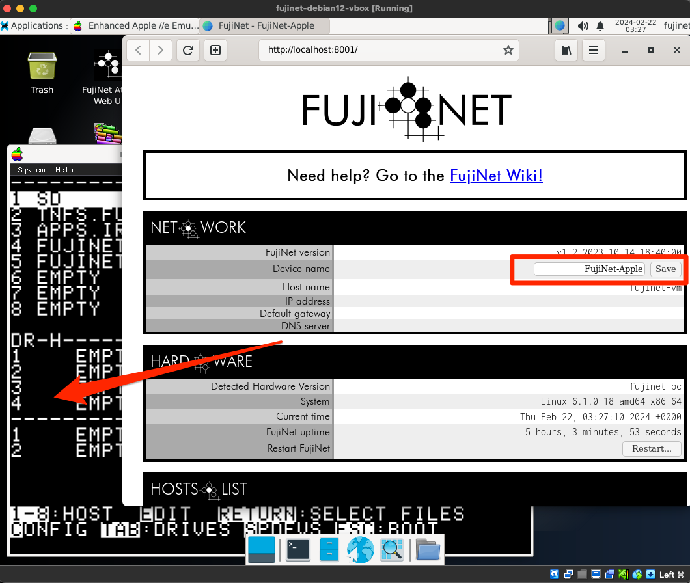

# FujiNet Web Interface Usage

The FujiNet Web UI can be launched for the various virtual FujiNet devices using the FujiNet icons on the desktop.  Double-clicking on these icons will open the web browser to the appropriate URL to display the Web UI.

## FujiNet for Atari

The Atari FujiNet Web UI can be opened at any time regardless of whether the Altirra emulator has been started or not.  Note the host name pre-defined in the UI indicating which virtual FujiNet the UI is related to:

## FujiNet for Apple II

The Apple FujiNet Web UI **_cannot_** be loaded **_without_** running the AppleWin emulator first.  The virtual FujiNet device requires a connection to the emulated Apple computer before it will start the web service.

Once AppleWin has been started the web UI will work properly.  Again, note the highlighted host name indicating the web UI's association to the virtual FujiNet.

